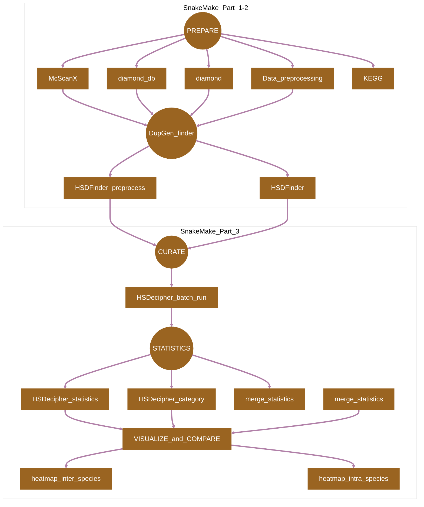
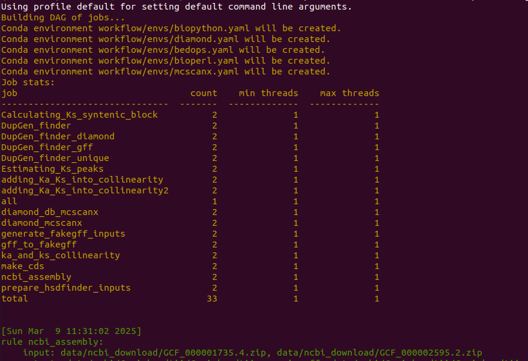
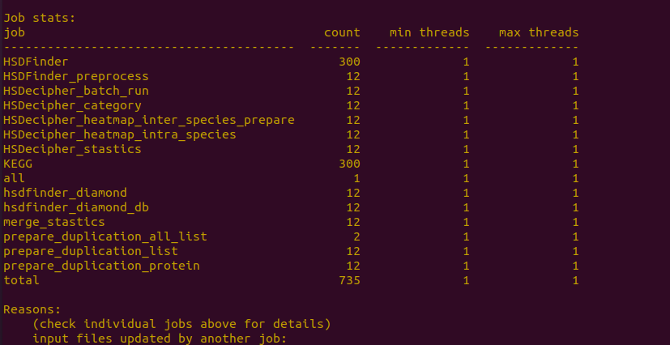

[](https://snakemake.readthedocs.io)
[](https://docs.conda.io/en/latest/)

## Introduction

**HSDSnake** is a [SnakeMake](https://snakemake.readthedocs.io) pipeline for comprehensive analysis of highly similar duplicates (HSDs) in genomes. The tools are shown in the [Pipeline Flowchart](#pipeline-flowchart) with [Detailed Usage](./docs/Usage.md) for each steps and their references are listed in [Citations.md](/docs/Citations.md).

## Pipeline Flowchart



## Usage

Refer to [Usage](./docs/Usage.md) documents for details.

> [!NOTE]
> If you are new to Snakmake, please refer to [this page](https://snakemake.readthedocs.io/en/stable/getting_started/installation.html) on how to set-up SnakeMake. Make sure to test the sample data below before running the workflow on actual data.

```
# Test if you have successfully installed the SnakeMake
mamba activate snakemake
snakemake --help
```

> [!NOTE]
> Begin with a `config.yaml` file as below (detailed all the input files requested for hsdsnake).
> 
> For demonstration, NCBI assemblies of *A. thaliana* and *C. reinhardtii* are used as examples, please only substitute the species name to yours in the config.yaml file, keep the input file format, such as Arabidopsis_thaliana.fa, Arabidopsis_thaliana.interproscan.tsv, Arabidopsis_thaliana.ko.txt.
>
> The outgroup species in the config.yaml file is used for cross-genome comparison, which is useful for suggesting other types of duplicates.

## Arguments
**config.yaml**
```config.yaml
ncbi_assemblies:
  - GCF_000001735.4
  - GCF_000002595.2

ncbi_genomes:
    Athaliana:
        ncbi_assembly: "data/ncbi_download/GCF_000001735.4.zip"
        assembly_id: "GCF_000001735.4"      
        outgroup: "Creinhardtii"
        interproscan: "data/Athaliana.interproscan.tsv"
        KEGG: "data/Athaliana.ko.txt"
    
    Creinhardtii:
        ncbi_assembly: "data/ncbi_download/GCF_000002595.2.zip"
        assembly_id: "GCF_000002595.2"
        outgroup: "Athaliana"
        interproscan: "data/Creinhardtii.interproscan.tsv"
        KEGG: "data/Creinhardtii.ko.txt"

```

> [!NOTE]
> Optional: To add new species, users can simply put extra lines of species name, ncbi_assembly id and required files in the `config.yaml` file as above.
>
> The ncbi_assembly (e.g., GCF_000001735.4.zip) contains the standard genomic files from NCBI such as gff3, cds, protein.fa. The other two files XX.interproscan.tsv and XX.ko.txt can be acquried from dependencies which was [detailed here in the usage](./docs/Usage.md).

> [!NOTE]
> Optional: To download extra ncbi assembly 'XX.zip' from NCBI, users can substitue the ncbi_assembly id (e.g., GCF_000001735.4) with yours in the command below:

```
curl -OJX GET "https://api.ncbi.nlm.nih.gov/datasets/v2alpha/genome/accession/GCF_000001735.4/download?include_annotation_type=GENOME_FASTA,GENOME_GFF,RNA_FASTA,CDS_FASTA,PROT_FASTA,SEQUENCE_REPORT&filename=GCF_000001735.4.zip"

```
## Running

Now, you can run the pipeline using the following commands:

```
# Download the package
git clone https://github.com/zx0223winner/HSDSnake.git

# enter the working directory
cd HSDSnake
```
> [!NOTE]
>Due to the size of sample files (we have prepared users with the standard input files of NCBI genome assemblies for *A. thaliana* and *C. reinhardtii* ), please download the test data - `HSDSnake_data.tar.gz` through the Google drive [link](https://drive.google.com/file/d/1d-yYkrp4Ce-zN9_s8VGpOO35hpkiu69w/view?usp=sharing)

```
# Then decompress the file HSDSnake_data.tar.gz under the HSDSnake directory,
# This will bring you a data folder with test files ready 
tar -xvzf HSDSnake_data.tar.gz

# Then you can give a dry run by the following command.
snakemake --use-conda --cores all -s workflow/Snakefile_part1 -n

# If everthing is OK, then you can test the pipeline by running one after another:
snakemake --use-conda --cores all -s workflow/Snakefile_part1
snakemake --use-conda --cores all -s workflow/Snakefile_part2
snakemake --use-conda --cores all -s workflow/Snakefile_part3
```

## Dependency

```
    Data Processing: fastp, bowtie2, samtools, featureCounts/Subread, umi-tools, bedtools
    Python modules: pandas, cython, pybedtools, scipy, sklearn, statsmodels, rpy2
    R libraries: countdata

Test environment: fastp v0.20.0, bedtools v2.27.1, bowtie2 v2.3.5.1, samtools v1.10, featureCounts v2.03
```

#### Snakemake_part 1-2

#### Snakemake_part3



###  References
1. Xi Zhang, Yining Hu, Zhenyu Cheng, John M. Archibald (2023). HSDecipher: A pipeline for comparative genomic analysis of highly similar duplicate genes in eukaryotic genomes. StarProtocols. doi:  doi: https://doi.org/10.1016/j.xpro.2022.102014 
2. Zhang, X., Hu, Y. & Smith, D. R. 2022. HSDatabase - a database of highly similar duplicate genes from plants, animals, and algae. Database, doi:http://doi.org/10.1093/database/baac086.
3. Zhang, X. & Smith, D. R. 2022. An overview of online resources for intra-species detection of gene duplications. Frontiers in Genetics, doi: http://doi.org/10.3389/fgene.2022.1012788.
4. Xi Zhang, Yining Hu, David Roy Smith. (2021). HSDFinder: a BLAST-based strategy to search for highly similar duplicated genes in eukaryotic genomes. Frontiers in Bioinformatics. doi: http://doi.org/10.3389/fbinf.2021.803176
5. Xi Zhang, Yining Hu, David Roy Smith. (2021). Protocol for HSDFinder: Identifying, annotating, categorizing, and visualizing duplicated genes in eukaryotic genomes DOI: https://doi.org/10.1016/j.xpro.2021.100619
6. Xi Zhang, et.al. David Roy Smith (2021). Draft genome sequence of the Antarctic green alga Chlamydomonas sp. UWO241 DOI:https://doi.org/10.1016/j.isci.2021.102084

### References for Dependencies 
1. **McScanX_protocol**: Wang, Yupeng, et al. "Detection of colinear blocks and synteny and evolutionary analyses based on utilization of MCScanX." Nature Protocols 19.7 (2024): 2206-2229.
2. **McScanX**: Wang, Yupeng, et al. "MCScanX: a toolkit for detection and evolutionary analysis of gene synteny and collinearity." Nucleic acids research 40.7 (2012): e49-e49.
3. **DupGen_finder**: Qiao, Xin, et al. "Gene duplication and evolution in recurring polyploidization–diploidization cycles in plants." Genome biology 20 (2019): 1-23.
4. **KEGG_BlastKOALA**: Kanehisa, Minoru, Yoko Sato, and Kanae Morishima. "BlastKOALA and GhostKOALA: KEGG tools for functional characterization of genome and metagenome sequences." Journal of molecular biology 428.4 (2016): 726-731.
5. **InterProScan**: Jones, Philip, et al. "InterProScan 5: genome-scale protein function classification." Bioinformatics 30.9 (2014): 1236-1240.
6. **PAML**: Yang, Ziheng. "PAML 4: phylogenetic analysis by maximum likelihood." Molecular biology and evolution 24.8 (2007): 1586-1591.

### Links to the InterProScan and KEGG databases:
 
 1. Pfam 37.0 (Sep 2024, 21,979 entries): https://pfam.xfam.org
 2. InterPro 101.0 (Jul 2024, 45,899 entries):http://www.ebi.ac.uk/interpro/
 3. KEGG Orthology Database: https://www.genome.jp/kegg/ko.html
 4. InterProscan: https://github.com/ebi-pf-team/interproscan
 5. KEGG : https://www.kegg.jp/kegg/
 6. Diamond: https://github.com/bbuchfink/diamond
