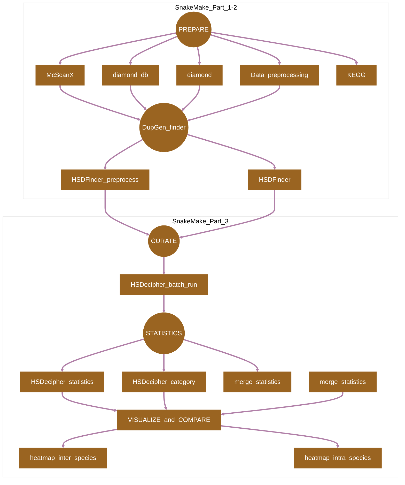

[](https://snakemake.readthedocs.io)
[](https://docs.conda.io/en/latest/)

## Introduction

**HSDSnake** is a [SnakeMake](https://snakemake.readthedocs.io) pipeline for comprehensive analysis of highly similar duplicates (HSDs) in genomes. The tools are shown in the [Pipeline Flowchart](#pipeline-flowchart) and their references are listed in [Citations.md](/docs/Citations.md).

## Pipeline Flowchart



## Usage

Refer to [Usage](./docs/Usage.md) documents for details.

> [!NOTE]
> If you are new to Snakmake, please refer to [this page](https://snakemake.readthedocs.io/en/stable/getting_started/installation.html) on how to set-up SnakeMake. Make sure to test the sample data below before running the workflow on actual data.

```
# Test if you have successfully installed the SnakeMake
mamba activate snakemake
snakemake --help
```


Prepare an `config.yaml` file with following columns representing input files for HSDSnake. For demonstration, NCBI data of *A. thaliana* and *C. reinhardtii* have been used as examples, please only substitute the species name to yours, keep the input file format, such as Arabidopsis_thaliana.fa, Arabidopsis_thaliana.interproscan.tsv, Arabidopsis_thaliana.ko.txt. Note: The outgroup species in the config.yaml file is used for cross-genome comparison.

```
ncbi_assemblies:
  - GCF_000001735.4
  - GCF_000002595.2

ncbi_genomes:
    Athaliana:
        ncbi_assembly: "data/ncbi_download/GCF_000001735.4.zip"
        assembly_id: "GCF_000001735.4"      
        outgroup: "Creinhardtii"
        interproscan: "data/Athaliana.interproscan.tsv"
        KEGG: "data/Athaliana.ko.txt"
    
    Creinhardtii:
        ncbi_assembly: "data/ncbi_download/GCF_000002595.2.zip"
        assembly_id: "GCF_000002595.2"
        outgroup: "Athaliana"
        interproscan: "data/Creinhardtii.interproscan.tsv"
        KEGG: "data/Creinhardtii.ko.txt"

```

Now, you can run the pipeline using the following commands:

```
# Download the package
git clone https://github.com/zx0223winner/HSDSnake.git

# enter the working directory
cd HSDSnake
```
> [!NOTE]
>Due to the size of sample files, please download the test data - `HSDSnake_data.tar.gz` through the Google drive [link](https://drive.google.com/file/d/1d-yYkrp4Ce-zN9_s8VGpOO35hpkiu69w/view?usp=sharing)

```
# Then decompress the file HSDSnake_data.tar.gz under the HSDSnake directory,
# This will bring you a data folder with test files ready 
tar -xvzf HSDSnake_data.tar.gz

# Then you can give a dry run by the following command.
snakemake --use-conda --cores all -s workflow/Snakefile_part1 -n

# If everthing is OK, then you can test the pipeline by running one after another:
snakemake --use-conda --cores all -s workflow/Snakefile_part1
snakemake --use-conda --cores all -s workflow/Snakefile_part2
snakemake --use-conda --cores all -s workflow/Snakefile_part3
```
#### Snakemake_part 1-2

#### Snakemake_part3


