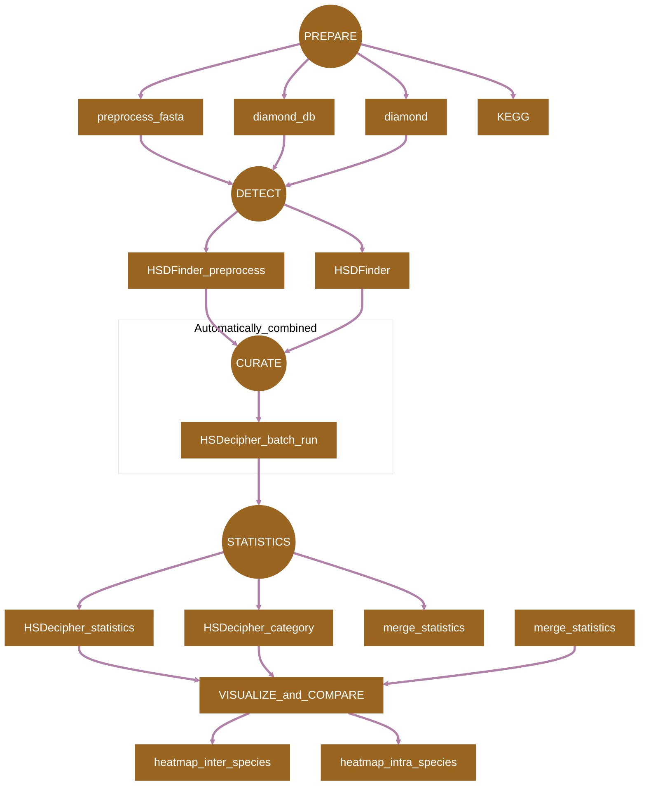
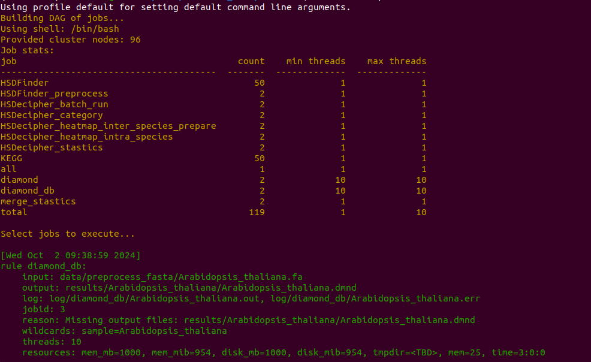

[](https://snakemake.readthedocs.io)
[](https://docs.conda.io/en/latest/)

## Introduction

**HSDSnake** is a [SnakeMake](https://snakemake.readthedocs.io) pipeline for comprehensive analysis of highly similar duplicates in genomes. The tools are shown in the [Pipeline Flowchart](#pipeline-flowchart) and their references are listed in [Citations.md](/docs/Citations.md).

## Pipeline Flowchart



## Usage

Refer to [usage](./docs/usage.md), [parameters](./docs/parameters.md) and [output](./docs/output.md) documents for details.

> [!NOTE]
> If you are new to Snakmake, please refer to [this page](https://snakemake.readthedocs.io/en/stable/getting_started/installation.html) on how to set-up SnakeMake. Make sure to test the sample data below before running the workflow on actual data.

```
# Test if you have successfully installed the SnakeMake
mamba activate snakemake
snakemake --help
```


Prepare an `config.yaml` file with following columns representing input files for HSDSnake, please only substitute the species name to yours, keep the input file format, such as Arabidopsis_thaliana.fa, Arabidopsis_thaliana.interproscan.tsv, Arabidopsis_thaliana.ko.txt.

```
samples:
  - Arabidopsis_thaliana
  - Chlamydomonas_reinhardtii
 
genomes:
  Arabidopsis_thaliana:
    proteins: "data/Arabidopsis_thaliana.fa"
    interproscan: "data/Arabidopsis_thaliana.interproscan.tsv"
    KEGG: "data/Arabidopsis_thaliana.ko.txt"

  Chlamydomonas_reinhardtii:
    proteins: "data/Chlamydomonas_reinhardtii.fa"
    interproscan: "data/Chlamydomonas_reinhardtii.interproscan.tsv"
    KEGG: "data/Chlamydomonas_reinhardtii.ko.txt"
```

Now, you can run the pipeline using the following commands:

```
# Download the package
git clone https://github.com/zx0223winner/HSDSnake.git

# enter the working directory
cd HSDSnake
```
> [!NOTE]
>Due to the size of sample files, please download the test data - `HSDSnake_data.tar.gz` through the [link](https://drive.google.com/file/d/15jGPsKRUn_SzXmaIAdXEQcxrychX-d9a/view?usp=sharing)

```
# Then decompress the file HSDSnake_data.tar.gz under the HSDSnake directory,
# This will bring you a data folder with test files ready 
tar -xvzf HSDSnake_data.tar.gz

# Then you can give a dry run by the following command.
snakemake --use-conda --cores all -n

# If everthing is OK, then you can test the pipeline by running:
snakemake --use-conda --cores all
```




