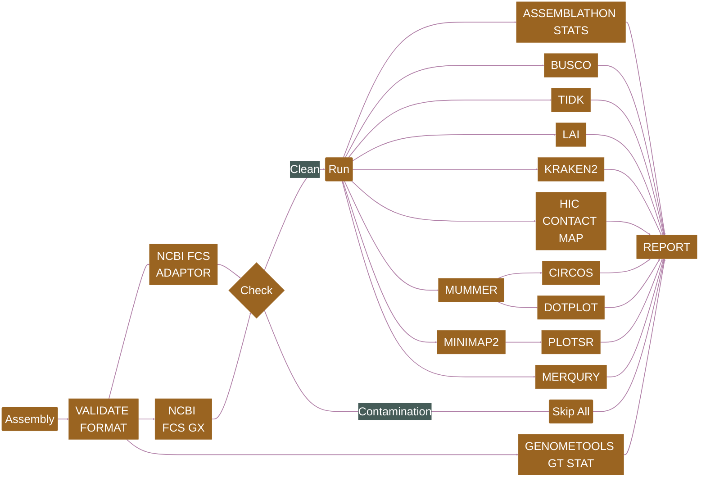

[](https://snakemake.readthedocs.io)
[](https://docs.conda.io/en/latest/)

## Introduction

**HSDSnake** is a [SnakeMake](https://snakemake.readthedocs.io) pipeline for comprehensive analysis of highly similar duplicates in genomes. The tools are shown in the [Pipeline Flowchart](#pipeline-flowchart) and their references are listed in [Citations.md](/doc/Citations.md).

## Pipeline Flowchart


```
├── Arabidopsis_thaliana
│   ├── Arabidopsis_thaliana.dmnd
│   ├── diamond
│   │   ├── Arabidopsis_thaliana.preprocess.txt
│   │   └── Arabidopsis_thaliana.txt
│   ├── hsdecipher
│   │   ├── batch_run
│   │   │   └── Arabidopsis_thaliana.batch_run.txt
│   │   ├── heatmap
│   │   │   ├── Arabidopsis_thaliana.output_heatmap.eps
│   │   │   └── Arabidopsis_thaliana.output_heatmap.tsv
│   │   └── stats
│   │       ├── Arabidopsis_thaliana.category.txt
│   │       ├── Arabidopsis_thaliana.complete.stats.txt
│   │       └── Arabidopsis_thaliana.stat.txt
│   ├── hsdfinder
│   │   ├── Arabidopsis_thaliana.50_100.txt
│   │   └── Arabidopsis_thaliana.90_70.txt
│   └── kegg
│       ├── Arabidopsis_thaliana.50_100.kegg.txt
│       └── Arabidopsis_thaliana.90_70.kegg.txt
├── Chlamydomonas_reinhardtii
│   ├── Chlamydomonas_reinhardtii.dmnd
│   ├── diamond
│   │   ├── Chlamydomonas_reinhardtii.preprocess.txt
│   │   └── Chlamydomonas_reinhardtii.txt
│   ├── hsdecipher
│   │   ├── batch_run
│   │   │   └── Chlamydomonas_reinhardtii.batch_run.txt
│   │   ├── heatmap
│   │   │   ├── Chlamydomonas_reinhardtii.output_heatmap.eps
│   │   │   └── Chlamydomonas_reinhardtii.output_heatmap.tsv
│   │   └── stats
│   │       ├── Chlamydomonas_reinhardtii.category.txt
│   │       ├── Chlamydomonas_reinhardtii.complete.stats.txt
│   │       └── Chlamydomonas_reinhardtii.stat.txt
│   ├── hsdfinder
│   │   ├── Chlamydomonas_reinhardtii.50_100.txt
│   │   └── Chlamydomonas_reinhardtii.90_70.txt
│   └── kegg
│       ├── Chlamydomonas_reinhardtii.50_100.kegg.txt
│       └── Chlamydomonas_reinhardtii.90_70.kegg.txt
└── heatmap_inter
    ├── HSD
    │   ├── Arabidopsis_thaliana.batch_run.txt
    │   └── Chlamydomonas_reinhardtii.batch_run.txt
    ├── HSD.output_heatmap.eps
    ├── HSD.output_heatmap.tsv
    └── ko
        ├── Arabidopsis_thaliana.ko.txt
        └── Chlamydomonas_reinhardtii.ko.txt

```




- [GENOMETOOLS GT GFF3VALIDATOR](https://genometools.org/tools/gt_gff3validator.html): GFF3 validation
- 

## Usage

Refer to [usage](./docs/usage.md), [parameters](./docs/parameters.md) and [output](./docs/output.md) documents for details.

> [!NOTE]
> If you are new to Nextflow and nf-core, please refer to [this page](https://nf-co.re/docs/usage/installation) on how to set-up Nextflow. Make sure to [test your setup](https://nf-co.re/docs/usage/introduction#how-to-run-a-pipeline) with `-profile test` before running the workflow on actual data.

Prepare an `assemblysheet.csv` file with following columns representing target assemblies and associated meta-data.

- `tag:` A unique tag which represents the target assembly throughout the pipeline and in the final report
- `fasta:` FASTA file

Now, you can run the pipeline using:

```bash
nextflow run plant-food-research-open/assemblyqc \
   -profile <docker/singularity/.../institute> \
   --input assemblysheet.csv \
   --outdir <OUTDIR>
```

> [!WARNING]
> Please provide pipeline parameters via the CLI or Nextflow `-params-file` option. Custom config files including those provided by the `-c` Nextflow option can be used to provide any configuration _**except for parameters**_;
> see [docs](https://nf-co.re/usage/configuration#custom-configuration-files).

### Plant&Food Users

Download the pipeline to your `/workspace/$USER` folder. Change the parameters defined in the [pfr/params.json](./pfr/params.json) file. Submit the pipeline to SLURM for execution.

```bash
sbatch ./pfr_assemblyqc
```


## Citations

If you use plant-food-research-open/assemblyqc for your analysis, please cite it as:

> **AssemblyQC: A Nextflow pipeline for reproducible reporting of assembly quality.**
>
> Usman Rashid, Chen Wu, Jason Shiller, Ken Smith, Ross Crowhurst, Marcus Davy, Ting-Hsuan Chen, Ignacio Carvajal, Sarah Bailey, Susan Thomson & Cecilia H Deng.
>
> _Bioinformatics_. 2024 July 30. doi: [10.1093/bioinformatics/btae477](https://doi.org/10.1093/bioinformatics/btae477).

An extensive list of references for the tools used by the pipeline can be found in the [`CITATIONS.md`](CITATIONS.md) file.

This pipeline uses code and infrastructure developed and maintained by the [nf-core](https://nf-co.re) community, reused here under the [MIT license](https://github.com/nf-core/tools/blob/master/LICENSE).

> **The nf-core framework for community-curated bioinformatics pipelines.**
>
> Philip Ewels, Alexander Peltzer, Sven Fillinger, Harshil Patel, Johannes Alneberg, Andreas Wilm, Maxime Ulysse Garcia, Paolo Di Tommaso & Sven Nahnsen.
>
> _Nat Biotechnol._ 2020 Feb 13. doi: [10.1038/s41587-020-0439-x](https://dx.doi.org/10.1038/s41587-020-0439-x).


### HSDSnake - a pipeline for comprehensive analysis of highly similar duplicates in genomes

```


#- Usage: snakemake --profile default all
# fastqc
# trim-cutadapt
# fastqc
# align-samtools, star, bedtools,
# mark duplicates - picard

#snakemake --profile default all
#snakemake --use-conda --cores all
#/storage/proj/expr_train
#/storage/proj/pea_genome/cram/analyses/proseq_02

#snakemake commom errors: 
#1. wild card not for all in a rule, 
#2. the output name doesnot match 
#3. symbols error e.g., missing , 
#4 the requirement of the resources are not enough 
#5.the input file is wrong


# configfile: "Metru-A17-Leaflet_config.yaml"

```


Data folder: https://drive.google.com/file/d/15jGPsKRUn_SzXmaIAdXEQcxrychX-d9a/view?usp=sharing
