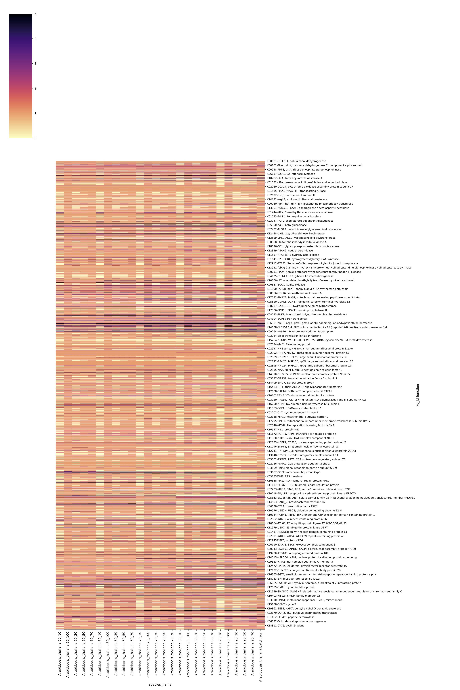

# HSDSnake: Usage<!-- omit in toc -->

## 1. [Config.yaml](../config.yaml) file 
You will need to edit the config.yaml file for your own usage. An [example config,yaml](../config.yaml) has been provided to test the pipeline.

> [!WARNING]
> please only substitute the species name to yours, keep the input file format, such as Arabidopsis_thaliana.fa, Arabidopsis_thaliana.interproscan.tsv, Arabidopsis_thaliana.ko.txt

``` conf.yaml
###### Here are the directories for fasta, interproscan, ko result you shall modify ######
samples:
  - Arabidopsis_thaliana
  - Chlamydomonas_reinhardtii

genomes:
  Arabidopsis_thaliana:
    proteins: "data/Arabidopsis_thaliana.fa"
    interproscan: "data/Arabidopsis_thaliana.interproscan.tsv"
    KEGG: "data/Arabidopsis_thaliana.ko.txt"

  Chlamydomonas_reinhardtii:
    proteins: "data/Chlamydomonas_reinhardtii.fa"
    interproscan: "data/Chlamydomonas_reinhardtii.interproscan.tsv"
    KEGG: "data/Chlamydomonas_reinhardtii.ko.txt"

####### Here are the directories for the custom scripts and parameters which do not need to modify #######
HSDFinder: 
  - "/scripts/hsdfinder/"

HSD_identity:
- 90
- 80
- 70
- 60
- 50

HSD_variance:
- 100
- 70
- 50
- 30
- 10

HSDecipher: "/scripts/hsdecipher/"

####### Feel free to tune these numbers for the heatmap hight and width #######

heatmap_hight: 20 
heatmap_width: 30

```

## 2. [Snakefile](../workflow/Snakefile)
### preprocess fasta
`Purpose`: This step is to generate a protein fasta file with short header line.

`scripts`: shell script
```
	mkdir -p {params.dir}; \
	awk '{{print $1}}' {input} \
```

`Output`: data/preprocess_fasta/Arabidopsis_thaliana.fa

```
>NP_001030613.1
MLLSALLTSVGINLGLCFLFFTLYSILRKQPSNVTVYGPRLVKKDGKSQQSNEFNLERLLPTAGWVKRALEPTNDEILSN
LGLDALVFIRVFVFSIRVFSFASVVGIFILLPVNYMGTEFEEFFDLPKKSMDNFSISNVNDGSNKLWIHFCAIYIFTAVV
```

> [!NOTE]
> Since amino acid substitutions occur less frequently than nucleotide substitutions, the sequence alignments are thereby generally evaluated by amino acid sequences instead of nucleotides, which allows a greater sensitivity (Koonin and Galperin, 2002). 

### diamond_db


`Purpose`: This step is to generate the local Diamond database

`scripts`: shell script
```
	diamond makedb \
		--in {input} \
		-d {params.db_name_dir} \
```

`Output`: results/Arabidopsis_thaliana/Arabidopsis_thaliana.dmnd

### diamond blastp
`Purpose`: This step is to generate local Diamond blastp all-against-all search which is quicker than BLAST.

`scripts`: shell script
```
		diamond blastp \
		-d {params.db_name_dir} \
		-q {input.protein} \
		-o {output} \
		-e 1e-10 \
		-f 6 \
		-p {threads} \
		--sensitive \
```

`Output`: results/Arabidopsis_thaliana/diamond/Arabidopsis_thaliana.txt

> [!NOTE]
> So we chose the protein sequence to do the Diamond blastp all-against-all search (Buchfink et al., 2015) (defaulted parameters: E-value cut-off ≤ 10-5, blastp -outfmt 6 etc.).

## interproscan
`Purpose`: This step is to generate the protein annotaion file by running interproscan search.

`scripts`: shell script
```
/interproscan.sh -i proteins_of_your_genome.fasta -f tsv -dp

```
`Output` : data/Arabidopsis_thaliana.interproscan.tsv

> [!Note]
> The InterProScan (Quevillon et al., 2005, Mitchell et al., 2019) and KEGG (Kanehisa and Goto, 2000b) are the only two dependencies without integrating into the HSDSnake pipeline due to the lack of Conda environment (the latest InterProScan Conda package of 5.59 fails in SnakeMake) and the limitation to web-only access in KEGG, such as BlastKOALA (Kanehisa et al., 2016)).

> [!TIP]
> It is straightforward to generate the InterProScan output by either checking the respective [ReadMe file](https://interproscan-docs.readthedocs.io/en/latest/) or following the [protocol](https://www.sciencedirect.com/science/article/pii/S2666166721003269) at Step 6-9.

## kegg blastkoala

`Purpose`: This step is to generate a KEGG functional category file.

`scripts`: local submission

`Output` :data/Arabidopsis_thaliana.ko.txt

> [!TIP]
> It is straightforward to generate the kegg blastkoala output by either checking the respective [website](https://www.kegg.jp/blastkoala/) or following the [protocol](https://www.sciencedirect.com/science/article/pii/S2666166721003269) at Step 17-20.
 
## HSDfinder preprocess
`Purpose`: This step is to [debug the previous raised potential issue with using HSDFinder](https://github.com/zx0223winner/HSDFinder?tab=readme-ov-file#how-to-deal-with-error-require-length-of-gene-)

`scripts`: shell script
```
	(awk '/^>/{{if (l!="") print l; print; l=0; next}}{{l+=length($0)}}END{{print l}}' \
		{input.protein} \
		|paste - - \
		|sed 's/>//g' \
		|awk -F'\t' '{{print $1"\t"$1"\t"100"\t"$2}}' \
		|cat ;\
		cat {input.tabular}) \
		|cat \

```

`Output`: results/Arabidopsis_thaliana/diamond/Arabidopsis_thaliana.preprocess.txt
	
## hsdfinder
`Purpose`: This step is the main script to generate  HSDs with different thresholds. 

`scripts`: shell script
```
	hsdfinder \
		-i {input.tabular} \
		-p {params.identity} \
		-l {params.variance} \
		-f {input.Interproscan} \
		-t Pfam \
		-o {output} \

```

`Output`: [results/Arabidopsis_thaliana/hsdfinder/Arabidopsis_thaliana.90_10.txt](../results/Arabidopsis_thaliana/hsdfinder/Arabidopsis_thaliana.90_10.txt)

> [!TIP]
> [For the specific usage of HSDFinder tool, please find here](https://github.com/zx0223winner/HSDFinder?tab=readme-ov-file#3-running-hsdfinder)

## kegg category
`Purpose`: This step is to apply KEGG functional category on the detected HSDs. 

`scripts`: shell script
```
	python3 $PWD{params.dir}HSD_to_KEGG.py \
		-i {input.HSD_result} \
		-k {input.KEGG} \
		-n {params.species_name}\
		-o {output} \

```

`Output`: [results/Arabidopsis_thaliana/kegg/Arabidopsis_thaliana.90_10.kegg.txt](../results/Arabidopsis_thaliana/kegg/Arabidopsis_thaliana.90_10.kegg.txt)

> [!TIP]
> [For the specific usage of HSD_to_KEGG.py, please read here](https://github.com/zx0223winner/HSDSnake/blob/main/docs/Readme-2.md#5-creating-heatmap)
 
## hsdecipher statistcs

`Purpose`: This step is to generate 
https://github.com/zx0223winner/HSDecipher#2-whats-hsdecipher

`scripts`: shell script
```
	python3 $PWD{params.dir}HSD_statistics.py \
		{params.HSD_dir} \
		{params.HSD_file_format} \
		{output} \

```


`Output`: [results/Arabidopsis_thaliana/hsdecipher/stats/Arabidopsis_thaliana.stat.txt](../results/Arabidopsis_thaliana/hsdecipher/stats/Arabidopsis_thaliana.stat.txt)
	
## hsdecipher category
`Purpose`: This step is to generate 

`scripts`: shell script
```
	python3 $PWD{params.dir}HSD_categories.py \
		{params.HSD_dir} \
		{params.HSD_file_format} \
		{output} \

```


`Output`: [results/Arabidopsis_thaliana/hsdecipher/stats/Arabidopsis_thaliana.category.txt](../results/Arabidopsis_thaliana/hsdecipher/stats/Arabidopsis_thaliana.category.txt)
	
## hsdecipher merge statistics
`Purpose`: This step is to generate 

`scripts`: shell script
```
	paste -d"\t" \
	{input.stat} \
	{input.category} \
	> {output} \

```

`Output`: [results/Arabidopsis_thaliana/hsdecipher/stats/Arabidopsis_thaliana.complete.stats.txt](../results/Arabidopsis_thaliana/hsdecipher/stats/Arabidopsis_thaliana.complete.stats.txt)
	
## hsdecipher batch run
`Purpose`: This step is to generate 

`scripts`: shell script
```
	mkdir -p {params.HSD_batch_run_dir}/{params.species_name}; \
	cp {params.HSD_dir}/* {params.HSD_batch_run_dir}/{params.species_name}/; \
	python3 $PWD{params.dir}HSD_batch_run.py \
		-i {params.HSD_batch_run_dir}; \
	rm -r {params.HSD_batch_run_dir}/{params.species_name} \

```

`Output`: [results/Arabidopsis_thaliana/hsdecipher/batch_run/Arabidopsis_thaliana.batch_run.txt](../results/Arabidopsis_thaliana/hsdecipher/batch_run/Arabidopsis_thaliana.batch_run.txt)
	
## hsdecipher heatmap intra species
`Purpose`: This step is to generate 

`scripts`: shell script
```
	mkdir -p {params.HSD_heatmap_dir}/{params.species_name}; \
	mkdir -p {params.ko_dir}; \
	sleep 60s; \
	cp {input.KEGG} {params.ko_dir}/; \
	cp {params.HSD_dir}/* {params.HSD_heatmap_dir}/{params.species_name}/; \
	cp {params.batch_run} {params.HSD_heatmap_dir}/{params.species_name}/; \
	hsdecipher \
	-f {params.HSD_heatmap_dir}/{params.species_name} \
	-k {params.ko_dir} \
	-r {params.r} \
	-c {params.c}; \
	rm -r {params.ko_dir}; \
	rm -r {params.HSD_heatmap_dir}/{params.species_name}; \
	mv {params.heatmap} {params.HSD_heatmap_dir}; \
	mv {params.tabular} {params.HSD_heatmap_dir}; \

```

`Output`: results/Arabidopsis_thaliana/hsdecipher/heatmap/Arabidopsis_thaliana.output_heatmap.eps


			
## hsdecipher heatmap inter species	
`Purpose`: This step is to generate 

`scripts`: shell script
```
		mkdir -p {params.HSD_heatmap_dir}; \
		mkdir -p {params.ko_heatmap_dir}; \
		sleep 30s; \
		cp {params.batch_run} {params.HSD_heatmap_dir}; \
		cp {input.KEGG} {params.ko_heatmap_dir}; \
		hsdecipher \
		-f {params.HSD_heatmap_dir}\
		-k {params.ko_heatmap_dir} \
		-r {params.r} \
		-c {params.c}; \
		mv {params.heatmap} {params.HSD_heatmap}||true; \
		mv {params.tabular} {params.HSD_heatmap}||true; \

```

`Output`: results/heatmap_inter/HSD/HSD.output_heatmap.eps


> [!WARNING]
> PLOTSR performs a sequence-wise (preferably chromosome-wise) synteny analysis. The order of the sequences for each assembly is inferred from its `synteny_labels` file and the order of sequences in the FASTA file is ignored. As all the assemblies are included in a single plot and the number of sequences from each assembly should be same, sequences after the common minimum number are excluded. Afterwards, the sequences are marked sequentially as `Chr1`, `Chr2`, `Chr3`,... If a label other than `Chr` is desirable, it can be configured with the `synteny_plotsr_seq_label` parameter.

> [!TIP]
> If you wish to share such profile (such as upload as supplementary material for academic publications), make sure to NOT include cluster specific paths to files, nor institutional specific profiles.

## Core Nextflow arguments

> [!NOTE]
> These options are part of Nextflow and use a _single_ hyphen (pipeline parameters use a double-hyphen).

