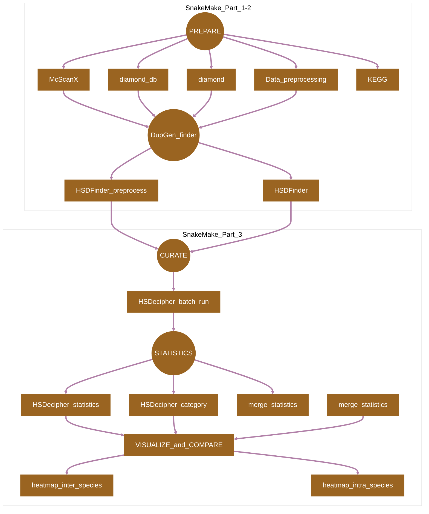

## Pipeline Flowchart

```mermaid
%%{init: {
    'theme': 'base',
    'themeVariables': {
    'fontSize': '18px",
    'primaryColor': '#9A6421',
    'primaryTextColor': '#ffffff',
    'primaryBorderColor': '#9A6421',
    'lineColor': '#B180A8',
    'secondaryColor': '#455C58',
    'tertiaryColor': '#ffffff'
  }
}}%%
flowchart TD

subgraph SnakeMake_Part_1-2
  PREPARE((PREPARE)) ==> McScanX[McScanX]
  PREPARE ==> diamond_db[diamond_db]
  PREPARE ==> diamond[diamond]
  PREPARE ==> Data_preprocessing[Data_preprocessing]
  PREPARE ==> KEGG[KEGG]

  McScanX ==> DupGen_finder
  diamond_db ==> DupGen_finder
  diamond ==> DupGen_finder
  Data_preprocessing ==> DupGen_finder


  DupGen_finder((DupGen_finder)) ==> HSDFinder_preprocess[HSDFinder_preprocess]
  DupGen_finder ==> HSDFinder[HSDFinder]

end  

subgraph SnakeMake_Part_3
  HSDFinder_preprocess ==> CURATE
  HSDFinder ==> CURATE
  

  CURATE((CURATE)) ==> HSDecipher_batch_run[HSDecipher_batch_run]
 
  HSDecipher_batch_run ==> STATISTICS

  STATISTICS((STATISTICS)) ==> HSDecipher_statistics[HSDecipher_statistics]
  STATISTICS ==> HSDecipher_category[HSDecipher_category]
  STATISTICS ==> merge_stastics[merge_statistics]

  HSDecipher_statistics ==> VISUALIZE_and_COMPARE
  HSDecipher_category ==> VISUALIZE_and_COMPARE
  merge_statistics ==> VISUALIZE_and_COMPARE

  VISUALIZE_and_COMPARE ==> HSDecipher_heatmap_inter_species_prepare[heatmap_inter_species]
  VISUALIZE_and_COMPARE ==> HSDecipher_heatmap_intra_species[heatmap_intra_species]
end


```
